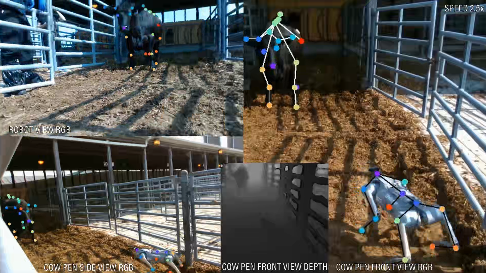

# MBE-ARI
Official Github Repository for the paper MBE-ARI: A Multimodal Dataset Mapping Bi-directional Engagement in Animal-Robot Interaction

# Multi-Stage Animal-Robot Interaction Experiment

This repository documents a multi-stage animal-robot interaction experiment using RGB-D Cameras from multiple angles. The experiment captures and analyzes interactions between a robot and a cow, focusing on both visual and pose estimation data. 

## Experiment Overview

The experiment is divided into three phases: Adaptation, Approach & Interaction, and Retreat. We used RGB-D cameras to capture the interaction from multiple perspectives: 
- **Robot POV**
- **Front View of the Cow Pen**
- **Side View of the Cow Pen**

Additionally, real-time joint labels for both the cow and the robot poses were generated by a pose prediction model. The depth stream, captured from the front view, is included to provide a multimodal analysis, combining RGB and depth data to gain a comprehensive understanding of animal-robot interactions.

---

### 1. **Adaptation Phase**

In the adaptation phase, the robot is introduced to the cow in a static position. The RGB views capture the cow's initial reactions and its adjustment to the robot's presence. Simultaneously, the pose prediction model tracks key joint movements, visualizing the animal's posture.

### 2. **Approach & Interaction Phase**

During the approach phase, the robot moves closer to the cow, gesturing to make the cow comfortable. The pose estimation model labels the joints continuously, tracking real-time updates of both the cow and robot's poses. This phase focuses on how the cow responds to the robot’s gestures, whether through curiosity, neutral behavior, or avoidance. Behavioral cues such as posture changes are mapped through the labeled joints in the RGB-D streams.

### 3. **Retreat Phase**

In the retreat phase, the robot gradually moves away from the cow. The cow's post-interaction behavior is captured, and subtle shifts in posture are highlighted through joint labels. These provide insights into the cow's response after the interaction concludes.

---

### Data Modalities
- **RGB Data**: Captured from multiple angles to provide a comprehensive view of the animal-robot interaction.
- **Depth Data**: Provides additional information on the spatial relationship between the cow and the robot.
- **Pose Estimation**: Real-time joint labels for both cow and robot, captured throughout all phases of the interaction.

### Video Demonstration

Click the image above to watch the full video, showcasing the experiment and the pose estimation model in action. The video highlights the multimodal data streams (RGB and depth) and the detailed labeling of cow and robot joints in real-time.

---

### Conclusion

This experiment highlights the power of combining pose estimation and multimodal data to understand animal responses to robotic systems. The joint tracking data provides valuable insights into the cow’s reactions across different phases of interaction, offering a foundation for further research into animal-robot dynamics.

---
